# Garage WebUI

A modern, feature-rich Web UI for [Garage S3](https://garagehq.deuxfleurs.fr/), built with Next.js.

## Quick Start

### Using Docker

Build the image locally:

```bash
make build
# or
docker build -t garage-webui .
# or using Docker hub image
docker pull leex2019/garage-webui:latest
```

Run the container:

```bash
docker run -p 3000:3000 \
  -e GARAGE_API_BASE_URL="http://your-garage-endpoint:3903" \
  -e GARAGE_ADMIN_TOKEN="your-admin-token" \
  -e S3_API_ENDPOINT="http://your-garage-endpoint:3900" \
  leex2019/garage-webui:latest
```

### Local Development

1. Install dependencies:
   ```bash
   make install
   # or
   npm install
   ```

2. Run the development server:
   ```bash
   export GARAGE_API_BASE_URL="http://your-garage-endpoint:3903"
   export GARAGE_ADMIN_TOKEN="your-admin-token"
   export S3_API_ENDPOINT="http://your-garage-endpoint:3900"
   # then
   make dev
   # or
   npm run dev
   ```

3. Open [http://localhost:3000](http://localhost:3000) with your browser.

## Configuration

The application can be configured using environment variables:

| Variable | Description | Required |
|----------|-------------|----------|
| `GARAGE_ADMIN_TOKEN` | The admin token for your Garage instance. Required for Admin features. | Yes (for Admin) |
| `GARAGE_API_BASE_URL` | The URL of your Garage Admin API (e.g., `http://localhost:3903`). | Yes |
| `S3_API_ENDPOINT` | The S3 API endpoint (e.g., `http://localhost:3900`). Used for proxying S3 requests. | Yes |

## Features

### Authentication
Support for both Admin Token login and S3 Access Key login.

| Admin Login | S3 Login |
|-------------|----------|
| 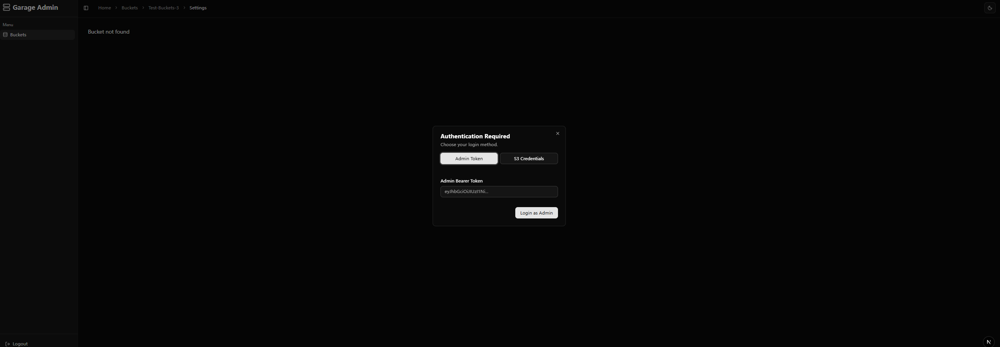 | 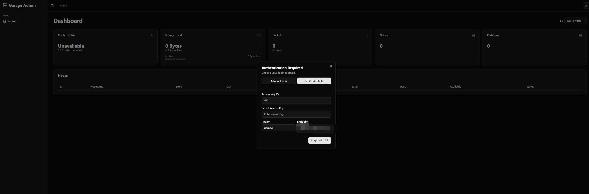 |

### Dashboard & Cluster Status
Monitor your Garage cluster health and status.

| Admin Dashboard | Cluster Status |
|-----------------|----------------|
| 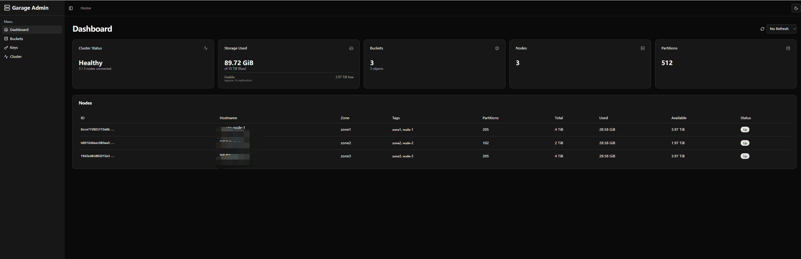 |  |

### Bucket Management
Create, browse, and configure buckets.

| Bucket List | Bucket Settings |
|-------------|-----------------|
| 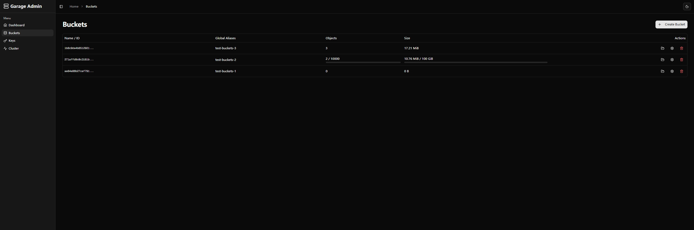 | 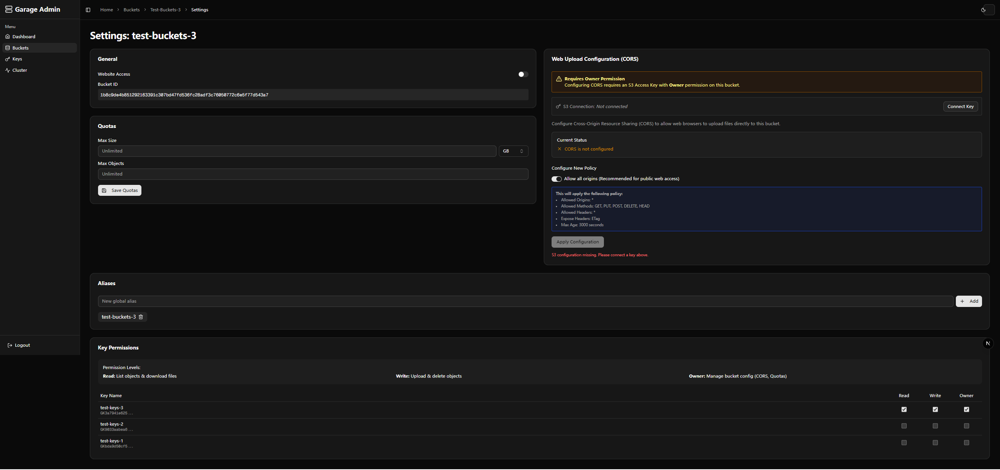 |

| File Browser | CORS & S3 Config |
|--------------|------------------|
| 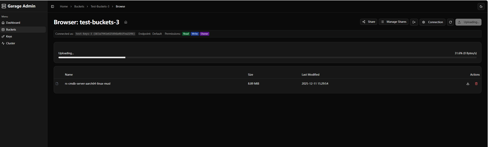 | 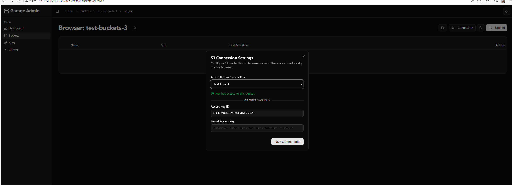 |

### Access Control
Manage Access Keys and permissions.

| Keys Management | Create Key |
|-----------------|------------|
| 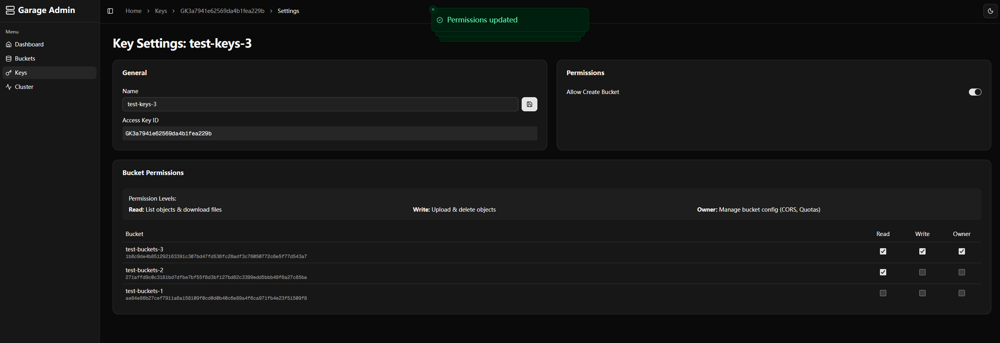 | 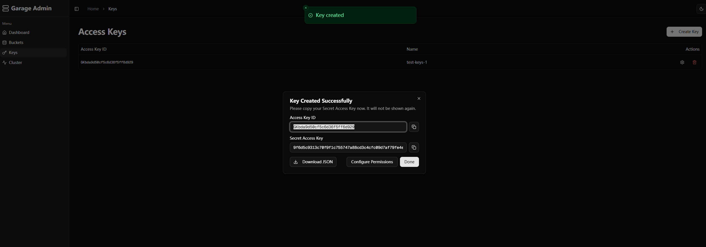 |

### S3 User Features
Specialized view for S3 users with permission-aware interfaces.

| S3 Bucket List | Create Permission | Read-Only View |
|----------------|-------------------|----------------|
| 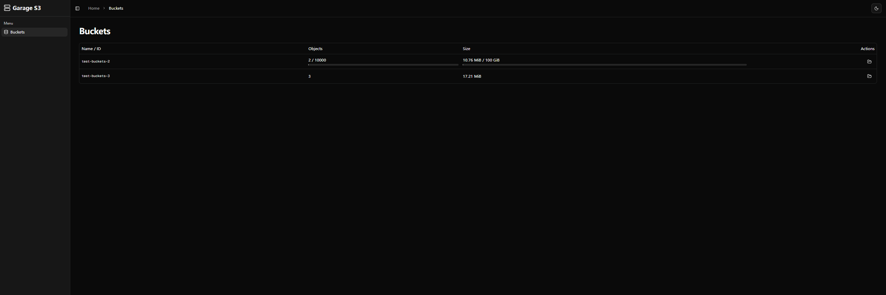 | 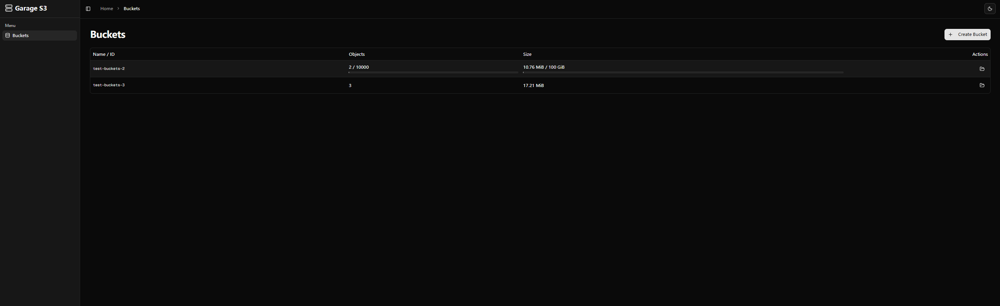 | 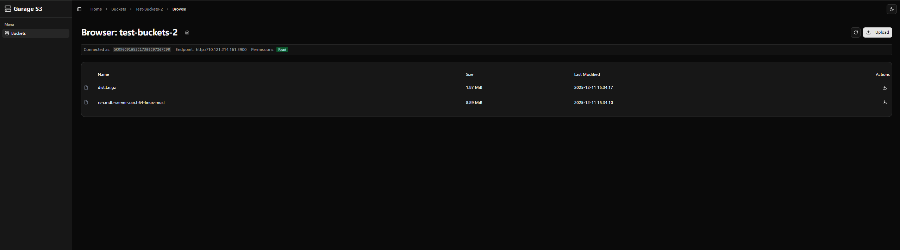 |

### Sharing (Experimental)
Share buckets and manage shared access.

| Share Buckets | Manage Shares |
|---------------|---------------|
| 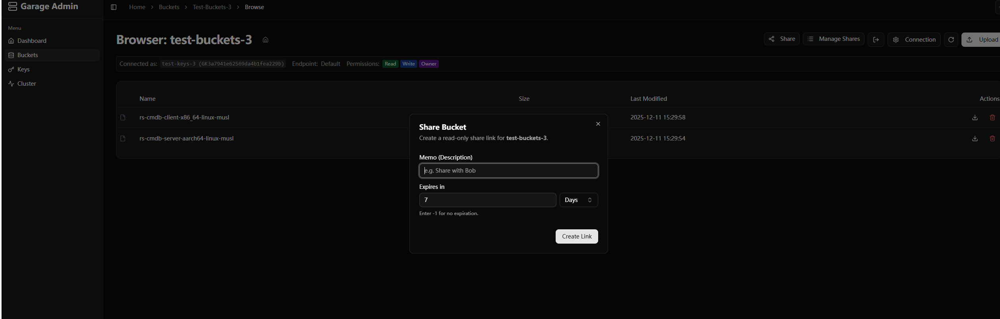 | 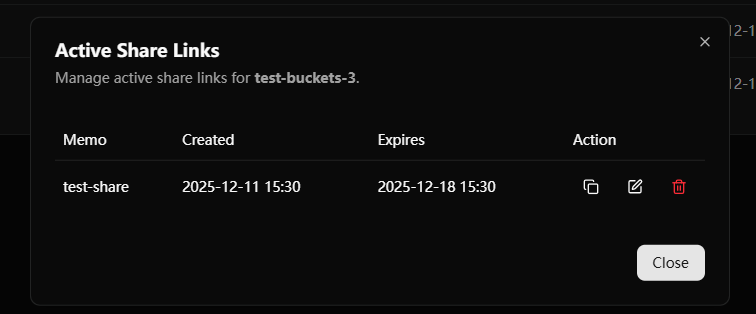 |

### Node Management
Edit node roles and configuration.

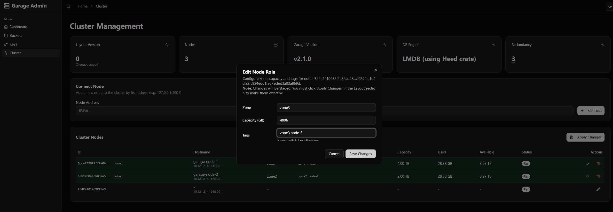

## Build Formats

- **Docker Image**: Production-ready standalone image (approx. 100MB).
- **Node.js**: Standard Next.js build (
> garage-webui@0.1.0 build
> next build

   ▲ Next.js 16.0.8 (Turbopack)
   - Experiments (use with caution):
     · middlewareClientMaxBodySize: "5000mb"
     · serverActions

   Creating an optimized production build ...
 ✓ Compiled successfully in 4.8s
   Running TypeScript ...).
